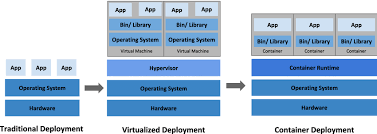
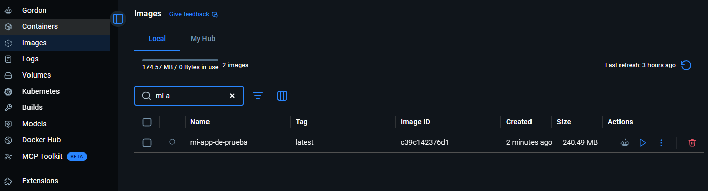

# Docker
* Es una tecnologia de contenedores
* Sirve para:
  * Aislar procesos (no hay interferencias entre aplicaciones)
  * Empaqueta apliaciones para: 
  * Distribuirlas de forma standar cons mismas librerias y mismos parametros permitiendo la
  * Implementacion de aplicaciones

 <br>

* cgroups es un conjunto de procesos que trabajan de forma aislada que conviven en un contenedor, a estos contenedores puedo asignarles una capacidad de memoria. Todo esto vive en un host o en la virtualizacion. Si uno de esto s procesos muere se vuelven a generar. Puede tener infintos contenedores con varios procesos.

<br>

* Imagen: Conjunto de archivos de solo lectura, es donde se empaqueta la aplicacion. Es   como un template.
* Registro: Repositorio de imagenes.
* Contenedor: Conjunto de procesos que se ponen a correr a partir de la imagen.
 
<br>

* Analogia con POO:
  * La imagen es la clase
  * La instania de la clase(la imagen) es el contendor, puedo crear varias instancias(contenedores) a partir de la clase(imagen). En POO hacemos un New para crear una clase y en Docker usamos el comando run.

<br>

* La imagen es de solo lectura, se almacena localmente, la imagen puede vivir en un contenedor aunque no este corriendo
* El contenedor es el conjunto de procesos que se crean a partir de la imagen que son efimeros (no persiste en estado), se muere el contenedor y se pierde toda la informacion.
* La aplicacion se almacena localmente, un contendor no existe sin la imagen


### Virtualizacion (Virtualized Deployment)
* Instalar otro OS en una maquina anfritiona compartiendo parte del hardware. Utiliza una tecnologia llamada **Hypervisor**.
* Se parte de un hardware que tiene un OS base y sobre eso se monto otros OS. Demora mucho, hay que instalar todo un OS completo.

### Tecnologia de contenedores (Container Deployment)
* Tenemos el harware con su OS, el **Container Runtime**(Docker) que es la maquina que puede correr contenedores y sobre ella agarro una imagen y a partir de ella corro una aplicacion o varias aplicaciones. El OS es compartido entre todas las aplicaciones 

<br>




## Pasos
* Buscar una imagen de la Regitry (por ejemplo docker hub)
* Descargarla - por comando descargar: docker pull 'nombre-imagen'
* Correrla - mediante comando: docker run 'nombre-imagen'- ***NOTA: Si no la descargue antes automaticamente este comando la baja y la corre***

## Modificadores:
* Correr en background(como demon): docker run -d 'nombre-imagen'
  * Elegir version: docker run -d 'nombre-imagen':'version'
* Elegir el puerto(direccionamiento de puerto): docker run -p 'puerto-que-quiero':'puerto-donde-trabaja-la-app' 'nombre-imagen' ej: docker run -d -p 3001:80 nginx
* Consultar contendores cooriendo: docker ps
* Parar un contenedor: docker stop 'id-contendor'
* Borrar el contenedor: docker rm 'id-contenedor'
* Borrar una imagen: docker rmi 'id-imagen'
* Meterme adentro del contenedor y volver: docker exec 'id-contenedor' 'comando'
* Meterme adentro del contenedor abriendo una consola: docker exec -it 'id-contenedor' bash/pwd
* Reemplezar el archivo-carpeta del contendor por una local: docker run -v 'dir-local':'dir-contenedor' 'nombre-imagen' ej: docker run -d -p 3001:80 -v 'D:\Users\angie\UNAHUR\ESTRATEGIAS DE PERSISTENCIA\Practica MongoDB\Prueba:/usr/share/nginx/html' nginx ***NOTA: si hay espacios en la direccion se ponen las ' ' sino no es necesario***

## DockerFile
* En el directoio raiz de la api creamos un archivo llamado DockerFile
* Vamos a partir de una imagen ya existente
* Buscamos en docker hub la imagen, por ejemplo alguna version de node como la 22-alpine
* Y en el DockerFile escribimos

```Dockerfile
FROM node:22-alpine # Imagen Base

WORKDIR /app # Directorio de trabajo

COPY package.json ./ # Copia el package.json al directorio de trabajo

RUN npm ci --omit=dev #instala npm omitiendo dependencias de desarrollo

COPY . . # Copia el resto de los archivos al directorio de trabajo

CMD ["npm", "start"] # Comando para iniciar la aplicacion
```
* FROM parte de una imagen que ya existe y la baja
* WORKDIR /app setea el directorio de trabajo
* COPY copia el package al directorio /app
* RUN corre comandos
* CMD es el comando que se ejecuta para iniciar la aplicacion

## Building y Running
* Para construir la imagen: docker build -t 'nombre-imagen' 'directorio' ej: docker build -t mi-app . ***NOTA: el punto es para decirle que el DockerFile esta en el directorio actual, la -t viene de taggear***
* Si quieremos versinar la imagen: docker build -t 'nombre-imagen':'version' .
* Podemos buscar nuestra imagen con el comando: docker images
```bash
angie@DESKTOP-9SHUJHS MINGW64 /d/Users/angie/UNAHUR/ESTRATEGIAS DE PERSISTENCIA/Practica MongoDB
$ docker images
                                                                                                                         i Info →   U  In Use
IMAGE                     ID             DISK USAGE   CONTENT SIZE   EXTRA
mi-app-de-prueba:latest   c39c142376d1        240MB         59.1MB
nginx:latest              608a100c7165        241MB           66MB    U
```
* Tambien podemos buscarla desde Docker Desktop


* La corremos con el comando: docker run -d -p 3001:3005 mi-app-de-prueba ***NOTA: el puerto 3005 es el puerto donde esta corriendo la aplicacion que definimos en el index.js***

* Para ver mi aplicacion en el navegador: http://localhost:3001/productos


## Balanceo de carga (Load Balancing)
* Por ejemplo una solicitud se la envia al 4001, la siguiente al 4002 y asi sucesivamente, esto se hace para no saturar un solo contenedor y repartir la carga entre varios contenedores. 
* Como es sin estado no es necesario enviar la misma solicitud a la misma aplicacion.
* El algoritmo se llama Round Robin.

## Docker Compose 
* Meter dentro de una archivo la configuracion para poder levantar varios contenedores al mismo tiempo.
* Creo un archivo llamado docker-compose.yml
* En el archivo voy a configurar que se levanten las aplicaciones.
* yml es un formato que funciona en base a la identacion.

```yml
services:
  app1:
    image: mi-app-de-prueba:latest

  app2:
    image: mi-app-de-prueba:v2.0

  lb:
    image: nginx:latest
```
* Siempre empieza con services y luego el nombre del servicio, dentro de cada servicio se define la imagen que se va a usar para levantar el contenedor.
* lb es el load balancer, es el encargado de repartir la carga entre las aplicaciones.
* Voy a crear una carpeta llamada nginx y dentro de ella un archivo llamado default.conf que es el archivo que va ser el load balancer, en este archivo voy a configurar el balanceo de carga entre las aplicaciones.

```nginx
upstream api {
  server app1:3005;
  server app2:3005;
}
```
* el app1 y app2 son los nombres de los servicios que definimos en el docker-compose.yml, el puerto 3005 es el puerto donde esta corriendo la aplicacion.
```nginx
server {
  listen 80;
  location / {
    proxy_pass http://api;
    proxy_set_header Host $host;
    proxy_set_header X-Real-IP $remote_addr;
    proxy_set_header X-Forwarded-For $proxy_add_x_forwarded_for;
    proxy_set_header X-Forwarded-Proto $scheme;
  }
}
```
* La configuracion esta le dice a nginx que escuche en el puerto 80 y que envie las solicitudes a la aplicacion api que definimos anteriormente, tambien le esta diciendo que envie los headers necesarios para que la aplicacion pueda identificar la solicitud.

* Entonces ahora al docker-compose.yml le tengo que agregar la configuracion para que el servicio lb use el archivo de configuracion que acabo de crear.

```yml
  lb:
    image: nginx:latest
    ports:
      - 5000:80
    volumes:
      - ./nginx/default.conf:/etc/nginx/conf.d/default.conf
```
* Esto quiere decir que al nginx le piso la configuracion que viene por defecto con la que yo cree. ('dir-mia':'dir-nginx')

* Para levantar todo esto en una terminal ubicada en el directorio del docker-compose.yml ejecuto el comando: 
```bash
docker-compose up
```
***NOTA: Si quiero puedo levantarlo en modo demon: docker-compose up -d***
* Devuelve:
```bash
angie@DESKTOP-9SHUJHS MINGW64 /d/Users/angie/UNAHUR/ESTRATEGIAS DE PERSISTENCIA/Practica MongoDB/Prueba/intro-api
$ docker compose up
Attaching to app1-1, app2-1, lb-1
lb-1  | /docker-entrypoint.sh: /docker-entrypoint.d/ is not empty, will attempt to perform configuration
lb-1  | /docker-entrypoint.sh: Looking for shell scripts in /docker-entrypoint.d/
lb-1  | /docker-entrypoint.sh: Launching /docker-entrypoint.d/10-listen-on-ipv6-by-default.sh
lb-1  | 10-listen-on-ipv6-by-default.sh: info: Getting the checksum of /etc/nginx/conf.d/default.conf
lb-1  | 10-listen-on-ipv6-by-default.sh: info: /etc/nginx/conf.d/default.conf differs from the packaged version
lb-1  | /docker-entrypoint.sh: Sourcing /docker-entrypoint.d/15-local-resolvers.envsh
lb-1  | /docker-entrypoint.sh: Launching /docker-entrypoint.d/20-envsubst-on-templates.sh
lb-1  | /docker-entrypoint.sh: Launching /docker-entrypoint.d/30-tune-worker-processes.sh
lb-1  | /docker-entrypoint.sh: Configuration complete; ready for start up
lb-1  | 2026/06/14 22:05:38 [notice] 1#1: using the "epoll" event method
lb-1  | 2026/06/14 22:05:38 [notice] 1#1: nginx/1.31.1
lb-1  | 2026/06/14 22:05:38 [notice] 1#1: built by gcc 14.2.0 (Debian 14.2.0-19)
lb-1  | 2026/06/14 22:05:38 [notice] 1#1: OS: Linux 6.18.33.1-microsoft-standard-WSL2
lb-1  | 2026/06/14 22:05:38 [notice] 1#1: getrlimit(RLIMIT_NOFILE): 1048576:1048576
lb-1  | 2026/06/14 22:05:38 [notice] 1#1: start worker processes
lb-1  | 2026/06/14 22:05:38 [notice] 1#1: start worker process 29
lb-1  | 2026/06/14 22:05:38 [notice] 1#1: start worker process 30
lb-1  | 2026/06/14 22:05:38 [notice] 1#1: start worker process 31
lb-1  | 2026/06/14 22:05:38 [notice] 1#1: start worker process 32
lb-1  | 2026/06/14 22:05:38 [notice] 1#1: start worker process 33
lb-1  | 2026/06/14 22:05:38 [notice] 1#1: start worker process 34
lb-1  | 2026/06/14 22:05:38 [notice] 1#1: start worker process 35
lb-1  | 2026/06/14 22:05:38 [notice] 1#1: start worker process 36
lb-1  | 2026/06/14 22:05:38 [notice] 1#1: start worker process 37
lb-1  | 2026/06/14 22:05:38 [notice] 1#1: start worker process 38
lb-1  | 2026/06/14 22:05:38 [notice] 1#1: start worker process 39
lb-1  | 2026/06/14 22:05:38 [notice] 1#1: start worker process 40


app1-1  |
app2-1  |
app1-1  | > intro-api@1.0.0 start

app2-1  | > intro-api@1.0.0 start
app1-1  | > node index.js

app2-1  | > node index.js

app1-1  |
app2-1  |


app1-1  | La aplicación esta escuchando en el puerto 3005
app2-1  | La aplicación esta escuchando en el puerto 3005
lb-1    | 172.18.0.1 - - [14/Jun/2026:22:05:46 +0000] "GET /productos HTTP/1.1" 200 898 "-" "Mozilla/5.0 (Windows NT 10.0; Win64; x64) AppleWebKit/537.36 (KHTML, like Gecko) Chrome/149.0.0.0 Safari/537.36" "-"
lb-1    | 172.18.0.1 - - [14/Jun/2026:22:05:46 +0000] "GET /favicon.ico HTTP/1.1" 404 150 "http://localhost:5000/productos" "Mozilla/5.0 (Windows NT 10.0; Win64; x64) AppleWebKit/537.36 (KHTML, like Gecko) Chrome/149.0.0.0 Safari/537.36" "-"
lb-1    | 172.18.0.1 - - [14/Jun/2026:22:05:49 +0000] "GET / HTTP/1.1" 200 46 "-" "Mozilla/5.0 (Windows NT 10.0; Win64; x64) AppleWebKit/537.36 (KHTML, like Gecko) Chrome/149.0.0.0 Safari/537.36" "-"
```


